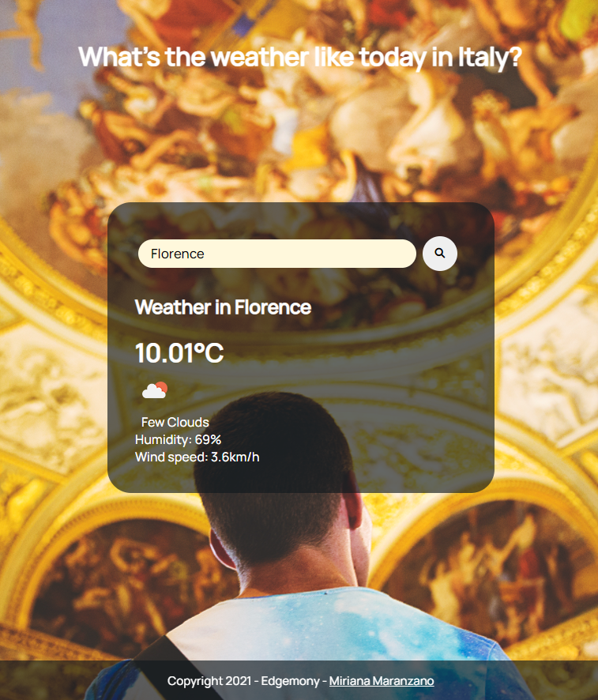

# Today Weather app in Italy #

##### Edgemony Coding Week Project  #####   

### This Forecast Weather app will allow tourists from all over the world to check what's the weather like in the main Italian cities 😃

### This will save them from some possible inconviences that may occur during their trip ⛈️☔🌪️ ###

### This app is also available for mobile devices 📱 by typing the city name in the search bar, the card will display the current temperature of the choosen city, a little description of the weather condition with the related icon 🌤️🌧️🌈 and some additional details such as the humidity percentage and the wind speed. Moreover, while consulting the weather, our tourists can enjoy some amazing background images that represent Italy. ###

### In conclusion, this little app was created by using the following coding languages: 🖥️ ### 

- HTML;
- CSS;
- Javascript Vanilla;
- API. 
  
  ### Please click in the following link to use this app: 👇🖱️ ### 

[click here](https://mirmara.github.io/Today-Weather-App-in-Italy/)